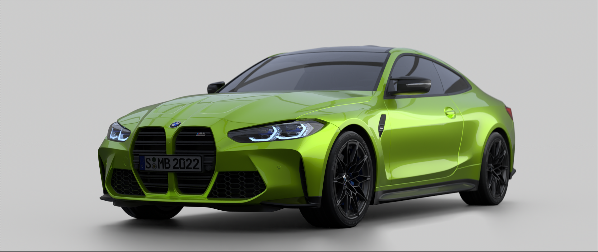

---
## Тестовый оракул: Многоканальный EXR-файл (010000.exr)

> [!abstract] Назначение
> Эталонные данные для проверки парсинга EXR файлов с помощью сторонней библиотеки OpenImageIO и корректности считывания пикселей в линейном цветовом пространстве.

---

## Паспорт файла (метаданные заголовков)

> [!abstract] Тестовое изображение
> 

| Параметр          | Значение            |
| ----------------- | ------------------- |
| **Разрешение**    | `1920 × 810`        |
| **Битность**      | `16-bit half float` |
| **Компрессия**    | `8 (DWAA)`          |
| **Размер файла**  | `34.9 MB`           |
| **Всего каналов** | `84`                |

<b>Нажми, чтобы развернуть (84 канала)</b>

ViewLayer_Ambient_Occlusion.blue
ViewLayer_Ambient_Occlusion.green
ViewLayer_Ambient_Occlusion.red
ViewLayer_Combined.alpha
ViewLayer_Combined.blue
ViewLayer_Combined.green
ViewLayer_Combined.red
ViewLayer_CryptoMaterial00.alpha
ViewLayer_CryptoMaterial00.blue
ViewLayer_CryptoMaterial00.green
ViewLayer_CryptoMaterial00.red
ViewLayer_CryptoMaterial01.alpha
ViewLayer_CryptoMaterial01.blue
ViewLayer_CryptoMaterial01.green
ViewLayer_CryptoMaterial01.red
ViewLayer_CryptoMaterial02.alpha
ViewLayer_CryptoMaterial02.blue
ViewLayer_CryptoMaterial02.green
ViewLayer_CryptoMaterial02.red
ViewLayer_CryptoObject00.alpha
ViewLayer_CryptoObject00.blue
ViewLayer_CryptoObject00.green
ViewLayer_CryptoObject00.red
ViewLayer_CryptoObject01.alpha
ViewLayer_CryptoObject01.blue
ViewLayer_CryptoObject01.green
ViewLayer_CryptoObject01.red
ViewLayer_CryptoObject02.alpha
ViewLayer_CryptoObject02.blue
ViewLayer_CryptoObject02.green
ViewLayer_CryptoObject02.red
ViewLayer_Denoising_Albedo.blue
ViewLayer_Denoising_Albedo.green
ViewLayer_Denoising_Albedo.red
ViewLayer_Denoising_Depth.Z
ViewLayer_Denoising_Normal.X
ViewLayer_Denoising_Normal.Y
ViewLayer_Denoising_Normal.Z
ViewLayer_Denoising_Roughness.X
ViewLayer_Denoising_Specular_Albedo.blue
ViewLayer_Denoising_Specular_Albedo.green
ViewLayer_Denoising_Specular_Albedo.red
ViewLayer_Depth.Z
ViewLayer_Diffuse_Direct.blue
ViewLayer_Diffuse_Direct.green
ViewLayer_Diffuse_Direct.red
ViewLayer_Diffuse_Indirect.blue
ViewLayer_Diffuse_Indirect.green
ViewLayer_Diffuse_Indirect.red
ViewLayer_Emission.blue
ViewLayer_Emission.green
ViewLayer_Emission.red
ViewLayer_Environment.blue
ViewLayer_Environment.green
ViewLayer_Environment.red
ViewLayer_Glossy_Direct.blue
ViewLayer_Glossy_Direct.green
ViewLayer_Glossy_Direct.red
ViewLayer_Glossy_Indirect.blue
ViewLayer_Glossy_Indirect.green
ViewLayer_Glossy_Indirect.red
ViewLayer_Noisy_Image.alpha
ViewLayer_Noisy_Image.blue
ViewLayer_Noisy_Image.green
ViewLayer_Noisy_Image.red
ViewLayer_Normal.X
ViewLayer_Normal.Y
ViewLayer_Normal.Z
ViewLayer_Transmission_Direct.blue
ViewLayer_Transmission_Direct.green
ViewLayer_Transmission_Direct.red
ViewLayer_Transmission_Indirect.blue
ViewLayer_Transmission_Indirect.green
ViewLayer_Transmission_Indirect.red
ViewLayer_Vector.W
ViewLayer_Vector.X
ViewLayer_Vector.Y
ViewLayer_Vector.Z
ViewLayer_Volume_Direct.blue
ViewLayer_Volume_Direct.green
ViewLayer_Volume_Direct.red
ViewLayer_Volume_Indirect.blue
ViewLayer_Volume_Indirect.green
ViewLayer_Volume_Indirect.red

---
## Эталонный пиксель

> [!info] Условия измерения
> * **Координата:** $(x: 976, y: 338)$ (В ПО для композитинга NukeX v16.0v4 отсчет пикселей производится начиная от левого нижнего угла)
> * **Color space:** `Linear / RAW` (без применения преобразований цвета или LUT)
> * **Допустимое отклонение:** $\epsilon=0.0001$ (из-за применяемого сжатия DWAA 8-го уровня)

| Канал | Эталонное значение (Nuke) | Допустимое значение |
| ----- | ------------------------- | ------------------- |
| **R** | `0.50244`                 | `0.50234 – 0.50254` |
| **G** | `0.87842`                 | `0.87832 – 0.87852` |
| **B** | `0.08716`                 | `0.08706 – 0.08726` |
| **A** | `1.00000`                 | `1.00000`           |

--- 
## Заметки и особенности тестового случая

* Сцена рендерилась в Blender с настройкой битности, равной `16-bit half float`;
* При просмотре пикселей в дальнейшем использованием графического интерфейса будущего приложения стоит учитывать, что, возможно, будет автоматически применяться преобразование цветового пространства. Поэтому проверку пикселей стоит делать строго в RAW-буфере.