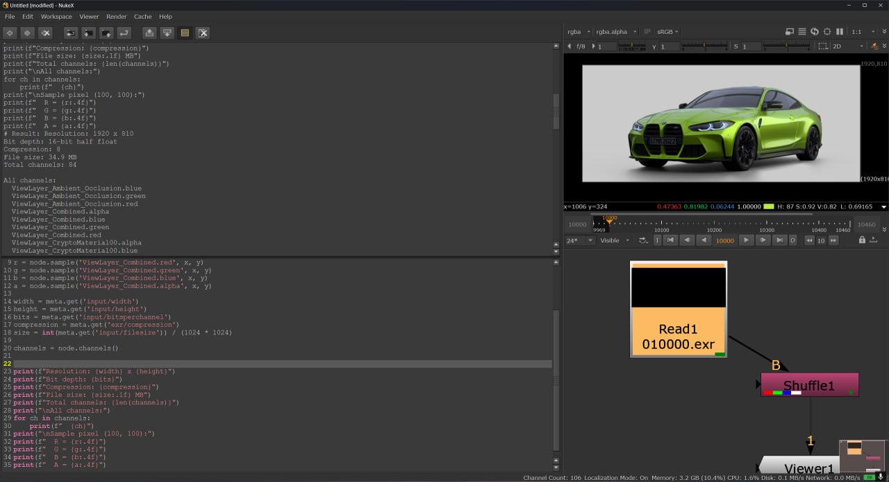

## 🚀 Этап 1: Начало работы, ознакомление с проблемой, создание оракула, создание первого спайка чтения EXR-файла

| 📅 Дата начала | 📅 Дата окончания | ⏱️ Затрачено времени | 🎯 Статус                  |
| :------------- | :---------------- | :------------------- | :------------------------- |
| `09.08.2026`   | `12.08.2026`      | **~5 часов**         | Завершен, остались вопросы |

---
### 📝 Задачи на этап
- [x] Отрендерить исходную сцену для создания оракула. Сцена подразумевает под собой проект в ПО Blender с присутствующей внутри моделью автомобиля (BMW M4), и плоскости пола. Освещение сцены построено за счет мировых источников света, а также точечных `Area Light`. Рендер секвенции должен быть выполнен посредством движком `Cycles` в разрешении `1920 x 810`, 540 кадров, формат `EXR`, компрессия типа `DWAA`, с использованием AOV-каналов для дальнейшего композитинга.
- [x] Создать структуру будущего проекта, связать ее с удаленным репозиторием, прописать базовый `.gitignore`
- [x] Создать локальное виртуальное окружение языка программирования `python3`, установить необходимые для теста зависимости (`OpenImageIO`, `rich`), оформить файл `requirements.txt`
- [x] После завершения рендера сцены из задачи 1 выписать опорные значения, на которые в дальнейшем будет направлен ориентир. Минимальный набор: разрешение, имена AOV-каналов, битность, тип компрессии, размер файла (место на диске), значение цвета выбранного пикселя
- [x] Создать скрипт на Python с использованием библиотеки `OpenImageIO`, который позволит прочитать метаданные того же отрендеренного файла для далнейшего сравнения с ранее выписанными эталонными значениями. Значение параметров, полученные с помощью скрипта, должны совпадать со значениями, тогда можно подтвердить, что библиотека работает, считывает файл корректно

---
### 🟢 Что получилось (Успехи)

Большинство задач получилось успешно выполнить, была создана структура проекта на локальном диске, затем связана с удаленным репозиторием, библиотеки установились с первой попытки, не выдав ошибок, оракул данных был составлен с помощью ПО для композитинга NukeX 16-ой версии без применения LUT-таблиц, чтение в RAW-формате. Некоторые данные были получены с помощью графического интерфейса, другие (напр., список каналов) было удобнее получить с помощью написания отдельного скрипта для извлечения данных.

С оракулом можно ознакомиться [здесь](exr_frame_data.md).

Отдельный скрипт на Python с использованием библиотеки `OpenImageIO` также был успешно написан, и на данный момент он верно считывает почти все данные. Единственным различием является значение цвета в выбранном пикселе, оно сильно отличается от чисел, которые я ранее видел в Nuke. Пока не удалось установить причину такого расхождения.

Ознакомиться со скриптом можно [здесь](../spikes/01_read_exr.py). Результаты скрипта первой версии лежат [здесь](01_script_output.md).

---
### 🔴 Что НЕ получилось

- Проблема со считыванием цвета выбранного пикселя. По моим догадкам, возможны несколько причин:
	- Библиотека `OpenImageIO` и Nuke по разному считывают положение пикселя;
	- Применяется скрытое преобразование цветов, из-за чего оттенок отличается;
	- Разные методы чтения. Nuke берет пиксель без сглаживания (`sample` с радиусом 0,0, либо через `Pixel Analyzer`), в то время как `OpenImageIO` может применять интерполяцию
	- Возможно, при конвертации из `half` во `float` в `OpenImageIO` используется другое округление

---
### ❓ Вопросы и идеи

- Главный вопрос: почему значения цвета пикселя, полученные через скрипт на `OpenImageIO`, не совпадают с эталонными значениями из Nuke, хотя все остальные параметры (разрешение, битность, компрессия, список каналов) сошлись?
- Попробовать читать данные напрямую с помощью `ImageInput`, который в отличие от `ImageBuf` не делает автоматического преобразования при загрузке, а читает байт-в-байт
- Создать тестовый градиентный EXR с заранее заданными значениями цветов и посмотреть, как справляются с его чтением `OpenImageIO` и будет ли разница в значениях пикселей

## Этап 1.1: Проблема пикселя решена

`Дата` - `12.08.2026`

Была решена проблема считывания цвета пикселя с помощью библиотеки `OpenImageIO`. Как и предполагалось, проблема  заключалась в том, что `Nuke` и `OpenImageIO` по-разному начинают отсчитывают положение пикселей. 

Доказательством, что дело не в цвете, является направление изменений: 

| Канал | Nuke    | OIIO    | Направление |
| ----- | ------- | ------- | ----------- |
| R     | 0.50244 | 0.20959 | упало       |
| G     | 0.87842 | 0.34961 | упало       |
| B     | 0.08716 | 0.10010 | **выросло** |
Любое цветовое преобразование (гамма, sRGB, экспозиция, LUT) — **монотонная функция**, и если она увеличивает один канал, должны увеличиваться все. В моем же случае канал синего цвета (B) пошел в другую сторону, что и исключает данную теорию.

Таким же образом отбрасываются и предположения о том, что `OIIO` применяет интерполяцию (функция `getpixel()` не способна на такое), и что при чтении half -> float дает округление (невозможно, так как half — подмножество float, а значит округление изменило бы только последние цифры, но никак не десятичные части чисел).

Таким образом, остается только одна причина: разный тип считывания положения пикселей. Nuke унаследовал систему координат от киноиндустрии — начало в левом **нижнем** углу, Y растёт вверх. Формат EXR (и OIIO вслед за ним) хранит строки сверху вниз — начало в левом верхнем углу.

![[nuke_vs_exr_pixel_position.png]]
