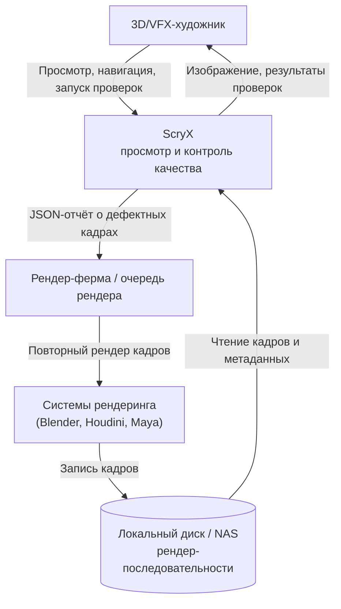
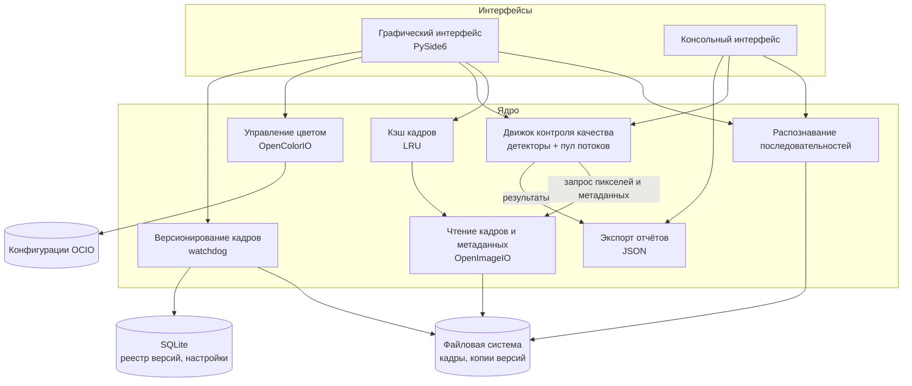
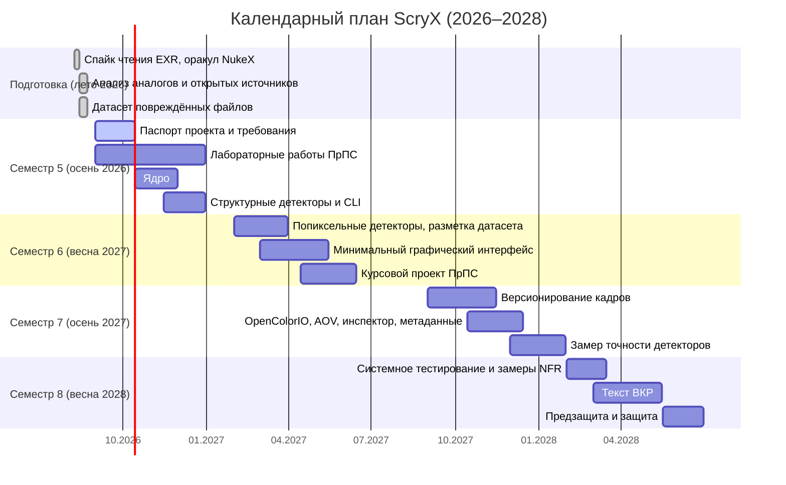

# Паспорт проекта и техническая спецификация ScryX

> Документ определяет научно-исследовательский аппарат, требования к системе, технологический стек, архитектуру, стратегию обеспечения качества, границы реализации, риски и календарный план разработки программного средства ScryX на 2026–2028 гг.

---
## Содержание

- [1. Научно-исследовательский аппарат](#1-научно-исследовательский-аппарат)
- [2. Научная новизна и практическая значимость](#2-научная-новизна-и-практическая-значимость)
- [3. Требования к системе](#3-требования-к-системе)
- [4. Технологический стек](#4-технологический-стек)
- [5. Архитектура системы](#5-архитектура-системы)
- [6. Стратегия обеспечения качества](#6-стратегия-обеспечения-качества)
- [7. Границы реализации](#7-границы-реализации)
- [8. Риски](#8-риски)
- [9. Календарный план](#9-календарный-план)
- [10. Связанные документы](#10-связанные-документы)

---
## 1. Научно-исследовательский аппарат

### 1.1. Цель работы

Разработка программного средства для просмотра и автоматизированного контроля качества рендер-последовательностей (OpenEXR, PNG, JPEG, TIFF), позволяющего выявлять технические дефекты рендеринга до передачи материала на следующие этапы производства и сократить долю ручного визуального отсмотра.

### 1.2. Объект исследования

Процессы воспроизведения, контроля качества и проверки целостности рендер-последовательностей в производстве компьютерной графики, анимации и визуальных эффектов (CG/VFX).

### 1.3. Предмет исследования

Алгоритмы автоматического обнаружения технических дефектов рендер-последовательностей и программные механизмы неразрушающего покадрового версионирования в инструментах просмотра рендеров.

### 1.4. Задачи работы

1. **Аналитическая.** Исследовать существующие решения (DJV, OpenRV, mrv2) и пользовательские обсуждения в открытых источниках, провести негативное тестирование аналогов на повреждённых данных, систематизировать типовые технические дефекты рендеринга и сформировать требования к системе.
2. **Проектная.** Спроектировать архитектуру программного средства, модель данных покадрового версионирования и модель фоновой обработки кадров без блокировки пользовательского интерфейса.
3. **Алгоритмическая.** Разработать детекторы дефектов: нарушений кадровой последовательности, повреждений файлов, аномальных значений пикселей (NaN, Inf, недопустимые отрицательные значения) и нарушений альфа-канала.
4. **Интерфейсная.** Реализовать графический интерфейс для просмотра последовательностей, переключения AOV-каналов, отображения результатов контроля качества и работы с версиями кадров.
5. **Методическая.** Разработать методику оценки детекторов: формирование и разметку тестового датасета (синтетические дефекты и собственные рендер-последовательности), выбор метрик точности (precision, recall, матрица ошибок).
6. **Экспериментальная.** Провести тестирование программного средства на подготовленном датасете, измерить точность детекторов и показатели быстродействия, сопоставить результаты с требованиями.

---
## 2. Научная новизна и практическая значимость

### 2.1. Научная новизна

1. **Метод автоматизированного контроля качества рендер-последовательностей (Preflight QC).**
   Предлагается набор детекторов технических дефектов, объединённых в единую процедуру проверки последовательности: структурные проверки (пропуски в нумерации, файлы нулевого размера, нечитаемые заголовки, повреждённые данные) и проверки значений пикселей (NaN, Inf, недопустимые отрицательные значения, выход альфа-канала за допустимый диапазон). В отличие от визуального контроля, применяемого в существующих просмотрщиках, эффективность метода оценивается измеримыми показателями точности (precision, recall) на размеченном тестовом датасете.

2. **Механизм неразрушающего покадрового версионирования (Tiered Filmstrip).**
   Предлагается механизм, который отслеживает перезапись файлов последовательности внешними системами рендеринга, сохраняет копию предыдущей версии кадра и отображает версии в виде вертикального стека на ленте кадров. Это позволяет сравнивать версии отдельного кадра в контексте последовательности и исключает потерю предыдущей версии без явного подтверждения пользователя. Существующие просмотрщики при перерендере отображают только текущее содержимое файла.

### 2.2. Практическая значимость

1. **Сокращение ручного отсмотра.** Автоматическая проверка последовательности указывает конкретные дефектные кадры и области, что сокращает время ручной инспекции и снижает вероятность передачи скрытого брака на этап композитинга.
2. **Экономия вычислительных ресурсов.** Машиночитаемый отчёт о дефектных кадрах позволяет отправлять на повторный рендеринг только проблемные кадры, а не всю последовательность.
3. **Защита итераций.** Сохранение предыдущей версии кадра при перерендере снижает риск потери удачного варианта при точечной корректировке сцены.

---
## 3. Требования к системе

### 3.1. Обозначения источников требований

Каждое требование связано с источником, из которого оно выведено (трассируемость требований).

| Код | Источник |
| --- | --- |
| `UR-n` | Пункт *n* документа [«Анализ пользовательских обсуждений»](../docs/user_research.md) |
| `CA-x.y` | Раздел *x.y* документа [«Сравнительный анализ аналогов»](../docs/competitor_analysis.md) |
| `NT` | Результаты негативного тестирования аналогов, [журнал разработки, этап 2](../docs/project_journal.md) |
| `SP` | Результаты спайков и изучения формата OpenEXR |
| `PC` | Исходная концепция продукта |

Приоритет: **MVP** — входит в дипломный проект; **После** — развитие после защиты.

### 3.2. Функциональные требования (FR)

#### Загрузка и чтение данных

| ID | Требование | Приоритет | Источник |
| --- | --- | --- | --- |
| FR-01 | Система должна читать файлы OpenEXR (single-part и multi-part) со сжатием NONE, RLE, ZIP, ZIPS, PIZ, DWAA, DWAB. | MVP | UR-5, UR-6, CA-3, CA-4 |
| FR-02 | Система должна читать файлы PNG, JPEG, TIFF. | MVP | CA-2 |
| FR-03 | Система должна распознавать последовательность кадров по содержимому папки, в том числе для схем именования `name.####.ext` и `######.ext`, и определять диапазон номеров кадров. | MVP | PC, NT |
| FR-04 | Система должна открывать последовательность при перетаскивании папки или файла в окно, а также через диалог открытия. | MVP | PC |

#### Просмотр и навигация

| ID | Требование | Приоритет | Источник |
| --- | --- | --- | --- |
| FR-05 | Система должна отображать кадр с возможностью масштабирования, панорамирования, вписывания в окно и полноэкранного режима. | MVP | PC |
| FR-06 | Система должна воспроизводить последовательность в прямом и обратном направлении, переходить на соседний кадр и на произвольный кадр по таймлайну, поддерживать частоту 24, 25, 30, 60 кадров/с. | MVP | CA-5 |
| FR-07 | Система должна отображать список AOV-каналов кадра, сгруппированный по слоям, и переключать отображаемый слой не более чем за 2 действия пользователя или по горячей клавише. | MVP | UR-6, CA-4, NT |
| FR-08 | Система должна отображать метаданные кадра: разрешение, область данных и область отображения, тип пикселей, тип сжатия, размер файла, список каналов, произвольные атрибуты заголовка. | MVP | CA-4 |
| FR-09 | Система должна отображать значения всех каналов выбранного слоя в пикселе под курсором (инспектор пикселя). | MVP | CA-4, SP |
| FR-10 | Система должна отображать ленту миниатюр кадров (filmstrip) для видимого диапазона таймлайна. | MVP | PC |
| FR-11 | Система должна поддерживать два режима интерфейса: «Просмотр» (изображение и таймлайн) и «Технический» (дополнительные панели), с переключением одним действием. | MVP | PC |

#### Контроль качества (Preflight QC)

| ID | Требование | Приоритет | Источник |
| --- | --- | --- | --- |
| FR-12 | Система должна обнаруживать пропуски в нумерации кадров последовательности. | MVP | CA-6, CA-11.1, NT |
| FR-13 | Система должна обнаруживать файлы нулевого размера. | MVP | CA-11.5, NT |
| FR-14 | Система должна обнаруживать файлы с нечитаемым заголовком. | MVP | UR-9, NT |
| FR-15 | Система должна обнаруживать файлы с повреждёнными данными изображения (обрезанный файл, участки данных, заменённые нулями) и не прерывать работу при их обработке. | MVP | UR-9, NT |
| FR-16 | Система должна обнаруживать значения NaN и Inf в каналах кадра и указывать координаты затронутых пикселей. | MVP | CA-11.5 |
| FR-17 | Система должна обнаруживать отрицательные значения в цветовых каналах. Каналы, для которых отрицательные значения допустимы (Normal, Vector, Depth и аналогичные), исключаются из проверки; список исключений настраивается. | MVP | CA-11.5 |
| FR-18 | Система должна обнаруживать значения альфа-канала вне диапазона [0, 1]. | MVP | CA-11.5 |
| FR-19 | Система должна обнаруживать расхождение списка каналов, разрешения, области данных и типа пикселей между кадрами одной последовательности. | MVP | CA-11.5, SP |
| FR-20 | Система должна присваивать каждому найденному дефекту уровень критичности (Warning, Error, Fatal). | MVP | CA-11.5 |
| FR-21 | Система должна отмечать дефектные кадры на таймлайне и ленте кадров, обеспечивать переход к следующему и предыдущему дефекту и выделять на кадре область дефекта для попиксельных проверок. | MVP | CA-11.5, PC |
| FR-22 | Система должна выполнять структурные проверки (FR-12…FR-15, FR-19) автоматически при открытии последовательности, а попиксельные (FR-16…FR-18) — по запросу пользователя в фоновом режиме с отображением прогресса и возможностью отмены. | MVP | PC |
| FR-23 | Система должна экспортировать результаты проверки в файл JSON с перечнем дефектных кадров, типов дефектов и уровней критичности. | MVP | CA-11.1 |
| FR-24 | Система должна предоставлять консольный режим проверки последовательности без графического интерфейса с выводом отчёта и ненулевым кодом завершения при наличии дефектов уровня Error и выше. | MVP | CA-9.6 |
| FR-25 | Система должна эвристически выявлять признаки несоответствия premultiplied/straight альфа-канала. | После | CA-11.5 |
| FR-26 | Система должна обнаруживать межкадровое мерцание яркости (flicker). | После | UR (раздел «Выводы»), CA-11.5 |

#### Версионирование и сравнение

| ID | Требование | Приоритет | Источник |
| --- | --- | --- | --- |
| FR-27 | Система должна отслеживать перезапись файлов открытой последовательности и перед заменой сохранять копию предыдущей версии кадра в служебном хранилище. | MVP | CA-11.4 |
| FR-28 | Система должна определять завершение записи файла внешней программой перед его обработкой. | MVP | CA-11.4 |
| FR-29 | Система должна отображать для кадра текущую и одну предыдущую версию на ленте кадров (предыдущая — уровнем ниже). | MVP | CA-11.4 |
| FR-30 | Система должна переключать отображение между версиями кадра одним действием (A/B). | MVP | CA-11.4, UR-11 |
| FR-31 | Система должна удалять сохранённую версию кадра только после явного подтверждения пользователя. | MVP | CA-11.4 |
| FR-32 | Система должна рассчитывать долю пикселей, различающихся между версиями кадра больше заданного порога. | После | CA-11.2 |
| FR-33 | Система должна хранить более одной предыдущей версии кадра. | После | CA-11.4 |

#### Управление цветом

| ID | Требование | Приоритет | Источник |
| --- | --- | --- | --- |
| FR-34 | Система должна применять к отображению преобразования OpenColorIO v2: выбор конфигурации, входного пространства, дисплея и преобразования (View) через интерфейс без настройки переменных окружения. | MVP | UR-3, UR-17, CA-8 |
| FR-35 | Система должна отображать значения инспектора пикселя (FR-09) в исходных линейных данных, независимо от выбранного преобразования отображения. | MVP | SP |
| FR-36 | Система должна предупреждать о различии цветовых настроек при сравнении двух последовательностей. | После | CA-11.3 |

### 3.3. Нефункциональные требования (NFR)

#### Эталонный стенд

| Компонент | Характеристика |
| --- | --- |
| Процессор | AMD Ryzen 7 7700 |
| Оперативная память | 32 ГБ |
| Видеокарта | NVIDIA GeForce RTX 4070 SUPER |
| Накопитель | SSD |
| ОС | Windows 11 |
| Эталонная последовательность | 540 кадров, 1920 × 810, OpenEXR, half float, DWAA, 84 канала, ~35 МБ/кадр |

Значения со статусом «Предварительно» уточняются по результатам замеров прототипа. Ориентир для сравнения — результаты замеров аналогов (NT): время до первого кадра DJV 3.3.3 — 1,53 с, mrv2 1.6.9 — 8,29 с.

| ID | Характеристика | Целевое значение | Способ измерения | Статус |
| --- | --- | --- | --- | --- |
| NFR-01 | Время запуска приложения до готовности окна | ≤ 3 с | Медиана 10 запусков; отметки времени в журнале приложения | Предварительно |
| NFR-02 | Время отображения первого кадра после открытия последовательности | ≤ 1,5 с | Медиана 10 открытий эталонной последовательности | Предварительно |
| NFR-03 | Скорость структурной проверки (FR-12…FR-15, FR-19) | ≥ 100 кадров/с | pytest-benchmark на эталонной последовательности | Предварительно |
| NFR-04 | Скорость попиксельной проверки (FR-16…FR-18) по каналам основного слоя (RGBA) | ≥ 10 кадров/с | pytest-benchmark на эталонной последовательности | Предварительно |
| NFR-05 | Отзывчивость интерфейса во время фоновой проверки | Задержка обработки событий интерфейса ≤ 100 мс | Замер задержки цикла событий во время проверки | Предварительно |
| NFR-06 | Потребление памяти | Без открытой последовательности ≤ 300 МБ; объём кэша кадров задаётся пользователем, вытеснение LRU | Системный монитор процессов | Предварительно |
| NFR-07 | Отказоустойчивость | 0 аварийных завершений на всех файлах тестового датасета; каждый повреждённый файл даёт запись о дефекте | Автотесты на датасете повреждённых файлов | Обязательно |
| NFR-08 | Точность структурных детекторов (FR-12…FR-15) | Precision = 1,0; Recall = 1,0 на тестовом датасете | Сравнение отчёта с разметкой датасета | Обязательно |
| NFR-09 | Точность попиксельных детекторов (FR-16…FR-18) | Precision ≥ 0,95; Recall ≥ 0,95 на тестовом датасете | Сравнение отчёта с разметкой датасета | Предварительно |
| NFR-10 | Удобство навигации | Переключение слоя AOV ≤ 2 действий; переход к следующему дефекту — 1 действие | Проверка по сценарию | Обязательно |
| NFR-11 | Платформы | Windows 10/11 x64 и macOS — поддерживаются и тестируются; Linux — сборка без гарантий | Запуск тестов и сценариев на целевых ОС | Обязательно |

---
## 4. Технологический стек

| Технология                                         | Роль в проекте                | Обоснование выбора                                                                                                                                             | Этап  |
| -------------------------------------------------- | ----------------------------- | -------------------------------------------------------------------------------------------------------------------------------------------------------------- | ----- |
| Python 3.11+                                       | Основной язык                 | Доступ к библиотекам обработки изображений (OpenImageIO, NumPy, OpenColorIO) в одном языке                                                                     | MVP   |
| PySide6 (Qt 6)                                     | Графический интерфейс         | Отраслевой стандарт интерфейсов CG-инструментов; один язык с ядром, без межпроцессного взаимодействия. Выбор между Qt Widgets и Qt Quick фиксируется в ADR-001 | MVP   |
| OpenImageIO                                        | Чтение форматов и метаданных  | Единый интерфейс ко всем поддерживаемым форматам, поддержка multi-part EXR и всех типов сжатия                                                                 | MVP   |
| NumPy                                              | Анализ значений пикселей      | Векторизованные вычисления над массивами кадра на нативном коде                                                                                                | MVP   |
| OpenColorIO v2                                     | Управление цветом             | Отраслевой стандарт цветовых преобразований                                                                                                                    | MVP   |
| watchdog                                           | Отслеживание изменений файлов | Кроссплатформенное наблюдение за файловой системой для версионирования                                                                                         | MVP   |
| SQLite                                             | Локальное хранение            | Реестр версий кадров, настройки, история; не требует отдельного сервера                                                                                        | MVP   |
| PyInstaller                                        | Сборка дистрибутива           | Упаковка приложения и зависимостей в исполняемый файл                                                                                                          | MVP   |
| pytest (+ pytest-cov, pytest-qt, pytest-benchmark) | Тестирование                  | Модульные, интеграционные тесты, тесты интерфейса, замеры производительности                                                                                   | MVP   |
| Ruff, mypy, pre-commit                             | Качество кода                 | Линтинг, форматирование, проверка типов до коммита                                                                                                             | MVP   |
| Git, GitHub, GitHub Actions                        | Версионирование и CI          | Хранение кода, автоматический запуск проверок и тестов                                                                                                         | MVP   |
| FastAPI, MySQL, Redis, Docker                      | Командный сервис              | Общая история проверок и публикация отчётов для команды                                                                                                        | После |
| Java, JUnit 5, AssertJ + Allure                    | Тестирование CI               | Системные тесты CLI                                                                                                                                            | MVP   |
| REST Assured                                       | Тестирование API              | Автоматизированное тестирование и проверка API                                                                                                                 | После |

---
## 5. Архитектура системы

### 5.1. Диаграмма системного контекста (C4: System Context)

В версии MVP передача отчёта на рендер-ферму выполняется пользователем вручную (файлом). Прямая интеграция с диспетчерами рендер-ферм относится к развитию после защиты.

### 5.2. Диаграмма компонентов (C4: Component)

Все компоненты работают в одном процессе приложения. Ядро не зависит от интерфейса: графический и консольный интерфейсы используют одни и те же компоненты ядра.

**Принципы:**

- Детекторы реализуют единый интерфейс: получают кадр или последовательность, возвращают список найденных дефектов. Новый детектор добавляется без изменения остального ядра.
- Длительные операции (чтение кадров, попиксельные проверки) выполняются в фоновых потоках; интерфейс получает результаты через сигналы Qt.
- Компоненты ядра не выводят данные в консоль и не обращаются к интерфейсу, а возвращают результат вызывающему коду. Это позволяет использовать их из GUI, CLI и тестов.

---
## 6. Стратегия обеспечения качества

### 6.1. Уровни тестирования

| Уровень            | Что проверяется                                                                                              | Инструменты                                      |
| ------------------ | ------------------------------------------------------------------------------------------------------------ | ------------------------------------------------ |
| Модульное          | Распознавание последовательностей, отдельные детекторы, разбор каналов, модель версий                        | pytest                                           |
| Интеграционное     | Чтение реальных файлов через OpenImageIO, работа детекторов на последовательностях, хранение версий в SQLite | pytest, тестовый датасет                         |
| Интерфейса         | Открытие последовательности, переключение слоёв, навигация по дефектам                                       | pytest-qt                                        |
| Системное          | Сквозные сценарии пользователя через GUI и CLI                                                               | Ручные тест-кейсы, CLI-тесты, Java               |
| Производительности | Требования NFR-01…NFR-06                                                                                     | pytest-benchmark, замеры по методике раздела 3.3 |

### 6.2. Тестовые данные

- **Эталонная последовательность** — собственный рендер (540 кадров, OpenEXR, DWAA, 84 канала).
- **Датасет повреждённых файлов** — копии эталонных кадров с внесёнными дефектами: пропуск в нумерации, файл нулевого размера, повреждённый заголовок, данные, заменённые нулями, обрезанный файл.
- **Синтетические попиксельные дефекты** — кадры с программно внесёнными NaN, Inf, отрицательными значениями, выходом альфа-канала за диапазон. Генерируются скриптом; в репозитории хранится скрипт, а не файлы.
- **Разметка датасета** — для каждого кадра фиксируются ожидаемые дефекты. Разметка служит оракулом при расчёте precision и recall.

### 6.3. Оракулы

- NukeX — эталонные значения метаданных и пикселей (документ «Тестовый оракул»).
- Утилиты OpenImageIO (`iinfo`, `idiff`) — независимая проверка метаданных и различий изображений.
- Разметка датасета — ожидаемые результаты детекторов.

### 6.4. Метрики

- Покрытие кода ядра тестами — не ниже 80 %.
- Precision и recall каждого детектора (NFR-08, NFR-09).
- Показатели быстродействия (NFR-01…NFR-06).

### 6.5. Процесс

- Каждый коммит в основную ветку проходит в GitHub Actions: проверку Ruff, mypy и автотесты.
- Дефекты регистрируются в GitHub Issues по единому шаблону баг-репорта.
- Требования связаны с тест-кейсами матрицей трассируемости.

---
## 7. Границы реализации

| Область | Дипломный проект (MVP) | Развитие после защиты |
| --- | --- | --- |
| Форматы | OpenEXR (single-part, multi-part, все типы сжатия), PNG, JPEG, TIFF | Deep EXR, DPX, видеофайлы (MOV, MP4, ProRes, DNxHR), OpenUSD |
| Контроль качества | Пропуски нумерации, файлы нулевого размера, нечитаемые заголовки, повреждённые данные, NaN, Inf, недопустимые отрицательные значения, выход альфа-канала за [0, 1], расхождение параметров между кадрами | Межкадровое мерцание (flicker), эвристика premultiplied/straight, анализ шума, анализ по маскам Cryptomatte |
| Версионирование | Текущая и одна предыдущая версия кадра, A/B-переключение, удаление по подтверждению | Произвольное число версий, количественное сравнение версий |
| Управление цветом | OpenColorIO v2: конфигурация, входное пространство, Display/View | Look/CDL, пользовательские 3D LUT, HDR-вывод, предупреждение о различии цветовых настроек |
| Отчётность | JSON-отчёт, консольный режим | PDF-отчёт с превью дефектов, интеграция с ShotGrid/Kitsu и диспетчерами рендер-ферм |
| Командная работа | — | Командный сервис: общая история проверок, публикация отчётов |

---
## 8. Риски

| Риск | Вероятность | Влияние | Меры |
| --- | --- | --- | --- |
| Недостаточная скорость чтения и анализа кадров на Python | Средняя | Высокое | Чтение только нужных каналов; векторизация на NumPy; фоновые потоки; ранние замеры по NFR-03, NFR-04 на прототипе |
| Нехватка времени (учёба, работа) | Высокая | Высокое | Приоритизация MVP; функции «После» не начинаются до завершения MVP; буфер в календарном плане |
| Трудоёмкость освоения Qt | Средняя | Среднее | Минимальный интерфейс к курсовому проекту, расширение позже; выбор Widgets/Quick фиксируется до начала разработки интерфейса |
| Ложные срабатывания детекторов | Средняя | Среднее | Подбор порогов на размеченном датасете; исключения каналов (FR-17); уровни критичности |
| Недостаточный объём датасета для оценки точности | Средняя | Среднее | Синтетическая генерация дефектов скриптом в дополнение к реальным примерам |
| Некорректная работа версионирования при записи файла рендерером | Средняя | Высокое | Проверка завершения записи (FR-28); тесты с имитацией постепенной записи файла |
| Рост объёма хранилища версий | Средняя | Низкое | Ограничение числа версий в MVP; удаление после подтверждения |

---
## 9. Календарный план

Разработка ведётся параллельно с дисциплиной «Проектирование программных систем»: в осеннем семестре 2026 года выполняются лабораторные работы по теме проекта, в весеннем семестре 2027 года — курсовой проект, к защите которого требуются работающее ядро и графический интерфейс.

### 9.1. Детализация по этапам

#### Подготовка (август 2026) — выполнено

- Спайк чтения OpenEXR через OpenImageIO, тестовый оракул в NukeX, выявление различия систем координат NukeX и OpenImageIO.
- Сравнительный анализ DJV, OpenRV, mrv2; негативное тестирование DJV и mrv2 на повреждённых данных.
- Анализ пользовательских обсуждений в открытых источниках.
- Датасет повреждённых файлов.

#### Семестр 5 (осень 2026)

- Паспорт проекта, требования, архитектурные решения (ADR).
- Лабораторные работы по дисциплине «Проектирование программных систем».
- Ядро: распознавание последовательностей, чтение кадров и метаданных.
- Структурные детекторы (FR-12…FR-15, FR-19), консольный режим (FR-24), JSON-отчёт (FR-23).
- Настройка CI, первые автотесты.

**Результат:** консольная утилита, проверяющая последовательность на структурные дефекты.

#### Семестр 6 (весна 2027)

- Попиксельные детекторы (FR-16…FR-18), уровни критичности (FR-20).
- Генерация синтетических дефектов и разметка датасета.
- Минимальный графический интерфейс: открытие последовательности, отображение кадра, таймлайн, воспроизведение, маркеры дефектов, переход к дефекту.
- Курсовой проект по дисциплине «Проектирование программных систем».

**Результат:** приложение с графическим интерфейсом и работающим ядром контроля качества.

#### Семестр 7 (осень 2027)

- Версионирование кадров (FR-27…FR-31), лента кадров (FR-10).
- Управление цветом (FR-34, FR-35), переключение AOV (FR-07), метаданные (FR-08), инспектор пикселя (FR-09), режимы интерфейса (FR-11).
- Замер precision и recall детекторов.

**Результат:** функционально завершённый MVP.

#### Семестр 8 (весна 2028)

- Системное тестирование, замеры NFR, исправление дефектов.
- Сборка дистрибутивов для Windows и macOS.
- Текст выпускной квалификационной работы.
- Предзащита и защита.

---
## 10. Связанные документы

| Документ | Назначение |
| --- | --- |
| [Анализ пользовательских обсуждений](../docs/user_research.md) | Источник требований `UR-n` |
| [Сравнительный анализ аналогов](../docs/competitor_analysis.md) | Источник требований `CA-x.y` |
| [Тестовый оракул](../docs/oracle_010000_exr.md) | Эталонные значения для проверки чтения OpenEXR |
| [Журнал разработки](../docs/project_journal.md) | Хронология работ, результаты негативного тестирования аналогов |
| [План разработки](development_plan.md) | Подробный план этапов |
